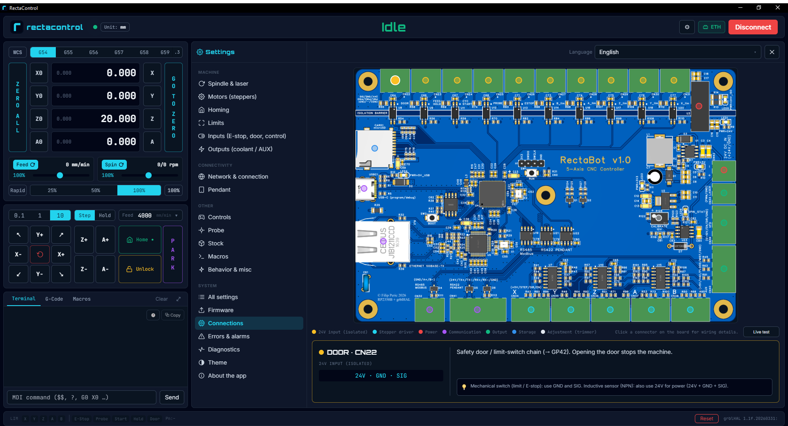

# RectaControl

**Branded desktop grblHAL sender for the RectaBot CNC controller (RP2350B).**

Electron + React + TypeScript. Connects over **USB** (virtual COM) or **Ethernet**
(W5500, telnet port 23), and shares its design language with the RectaBot
landing/configurator. Built as a paired, polished companion to the hardware —
tuned so the operator can't easily go wrong.



*Connections knows the board it is talking to: click a connector on the diagram and it
tells you what goes on each pin. The DRO, jog and terminal stay to the left, so nothing
is ever more than one click away from the machine.*

---

## 📊 Status

| | |
|---|---|
| **Version** | v0.1.0 (pre-release) |
| **Core** | Hardware-validated over USB + Ethernet on the RP2350B 4-axis (XYZA) board |
| **Target** | Windows portable `.exe` (macOS/Linux possible from the same codebase) |
| **License** | GPL-3.0 |

---

## Running (dev)

```bash
npm install      # serialport has a native build; postinstall rebuilds it for Electron
npm run dev      # electron-vite dev (HMR)
```

Build / package:

```bash
npm run build    # bundles main/preload/renderer into out/
npm run dist     # portable Windows .exe + installer in dist/
```

Type-check: `npm run typecheck` · Tests: `npm test`

The in-app flasher offers prebuilt images from `../Firmware/variants/**/*.uf2` — the
RectaBot firmware repository checked out beside this one; `npm run dist` copies them
into the package. Clone that repo alongside this one to get them. Without it the
flasher lists nothing of its own and flashes a `.uf2` you point it at instead.

---

## Features

- **Connection** — USB (COM port + baud) or Ethernet (IP + port 23), with auto-connect.
- **DRO** — live X/Y/Z/A, per-axis zero and "Zero all", G54–G59.3 work coordinate
  systems with an offsets table, work/machine toggle, mm/inch.
- **Jog** — step + continuous (hold-to-jog), keyboard and gamepad, soft-limit clamping
  once homed.
- **Homing / Unlock / soft-reset** — with state-gated controls (each command is only
  clickable in a state that accepts it).
- **Program** — load `.nc/.gcode`, run/hold/stop, progress + job timer, and
  **Park & Resume**: pause, jog the head free, then return to the stopped line and
  continue. A saved park position sends the head to a tool-change spot on demand.
- **3D visualizer** — toolpath (G0–G3) with a live tool marker, rotary/stock/grid
  views, and machined-path recolor as the job progresses (three.js).
- **G-code preview** — active line pinned mid-viewport, per-axis colors.
- **Overrides** — feed / spindle / rapid, live.
- **Probing** — tool Z touch-off; edge and corner zeroing (`X0`, `Y0`, `ZX0`, `ZY0`,
  `ZXY0`, `XY0` — the name is the order the cycle probes in); and skew, which measures
  how far the workpiece is turned and rotates the program in software to match. Each
  cycle is drawn as its numbered touches and ticked off as the machine makes them.
- **Aux outputs** — flood, mist and vacuum, live during a job.
- **Settings** — guided editor with smart controls (no bit-twiddling) plus a raw `$`
  browser with search, import/export, and a compare view against a saved file.
  Settings are backed up automatically whenever they change.
- **Error & alarm reference** — readable causes and recovery actions, with a
  "what do I do?" helper and one-click recovery buttons.
- **Connections & diagnostics** — a diagram of the board that explains each connector
  pin by pin; an input test that lights up the connector a switch is actually wired to
  (hard limits are suspended while it runs); an on-disk log of everything the machine
  said; and a one-click problem report that packs log, settings and versions into a zip.
- **Guided recovery** — walks a board whose settings were lost back to working:
  erase, reflash, restore from a backup.
- **Macros**, **firmware UF2 flash**, **SD file manager over FTP**, **PC g-code library**.
- **i18n** — control labels stay English (worldwide-standard commands); the selected
  language drives tooltips and descriptive content (English + Serbian).
- **Auto UI scale** — fits the UI to the monitor, multi-display aware, with manual override.

Streaming uses **character-counting flow control** (keeps the grblHAL RX buffer full
without overflowing) for smooth motion.

---

## Architecture

```
src/
├─ main/         Electron main process (Node)
│  ├─ transport/ serial.ts (USB) + ethernet.ts (telnet)
│  ├─ controller.ts  connection, status poll, streaming
│  ├─ ftp.ts / firmware.ts / library.ts   SD (FTP), UF2 flash, PC library
│  ├─ logger.ts / report.ts   on-disk log, problem-report zip
│  ├─ rescue.ts / settingsBackup.ts / updater.ts
│  └─ ipc.ts     IPC ↔ controller
├─ preload/      contextBridge → window.recta
├─ shared/       grbl.ts (parser + commands), messages/errors, settings-meta,
│                probe + skew, machine-config, i18n (en/sr)
└─ renderer/     React UI (Tailwind brand tokens, zustand store, three.js)
```

---

## Note

Separate project, shares the RectaBot GitHub org with the controller. Brand
tokens (colors/fonts) are synced with the configurator.
